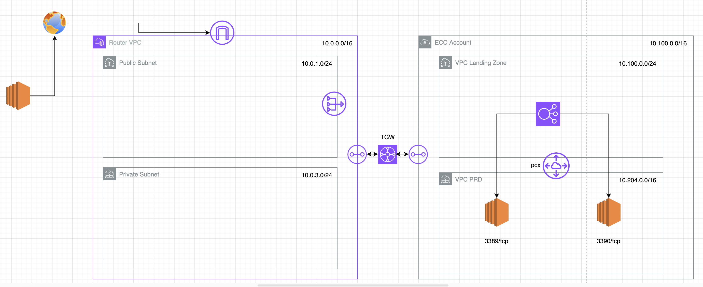

# lab1-network-aws

This project intend to show a basic AWS topology to anyone that want to explore how the resource make the communication between themselves. As explainded the goal is to introduct the users to the AWS network ecosystem and because of it we don't use Terraform modules.

**Important !!!** <br>Have in mind the any resource created in this lab may cost some dollars depend of time that will be active and in case of forgeten something running may cost a lot. So use the resource, and after finish the studies clean-up the Lab with "terraform destroy"

---

# Transit Gateway and Peering as an example of comunication between VPC's 

#### Table of Contents

* [Outcome](#Outcome)
* [What are we building?](#what-are-we-building)
* [What are the pre-requisites?](#what-are-the-pre-requisites)
* [How can I deploy the stack?](#how-can-i-deploy-the-stack)
* [How can I setup the suggested topology?](#how-can-i-setup-the-suggested-topology)
* [Let's cleanup](#lets-cleanup)
* [Security](#security)
* [License](#license)

## Outcome

We will build a regional network for this lab that could be development, stagging or production`us-east-1`. The infrastructure will be built using a combination of Terraform and AWS Console. The time to all resource be available is avarage 5 minutes.

Below routes are allowed by this architecture

|     Source    |  Destination  |
|:-------------:|:-------------:|
| Empresa-A | Empresa-B |
| Empresa-B | Empresa-A |
| Empresa-B | Empresa-C |
| Empresa-C | Empresa-B |

**Note:** There is no straight comunication between Empresa-A and Empresa-C

## What are we building?



## What are the pre-requisites?

* Install the following
  ```
  apt install terraform
  ```
  ```
  yum install terraform
  ```
  * https://developer.hashicorp.com/terraform/tutorials/aws-get-started/install-cli

* You have configured AWS CLI using `aws configure`
* The role being used from CLI has the permissions required for resources being created by Terraform.
* Create a Key name to access the EC2 instances after the build of infrastructure

## How can I deploy the stack?

Edit the file `terraform.tfvars` as you want to fullfill where you are running the Lab, changing mainly ISP IP, Key name and AWS account ID. The others values are not necessary change to follow with lab.

We build the below resources -

* VPC's
* Subnets
* Route Tables
* Internet Gateway
* NAT Gateway
* Transit gateway
* TransitGateway attachment
* TransitGateway association and propagation
* Peering connection
* EC2 instance Bastion on a public subnet from Empresa-A
* EC2 instace Empresa-A on a pivate subnet from Empresa-A
* EC2 instace Empresa-B on a pivate subnet from Empresa-B
* EC2 instace Empresa-C on a pivate subnet from Empresa-C
* Security Group allowing SSH access on EC2 instances
* VPC endpoints to access EC2 via SSM (It will adjusted in future)
* TransitGateway routing tables
* IAM Role VPC FlowLogs
* VPC Flowlogs

The script will build the stack in `us-east-1`.
If you need to use different regions, please update the `terraform.tfvars` file.

**Note:** The transit gateway peering and acceptance is handled in the Terraform.

## How can I setup the suggested topology?

* This demo was tested with Terraform version 

```shell
cd $PATH; terraform init
```
```shell
terraform plan
```
```shell
terraform apply
```

**Note:** You can verify the traffic flow using the Route Analyzer from Global Network or log-in on EC2 instaces connect by SSH

## Let's cleanup

```shell
terraform destroy
```

# Security

See [CONTRIBUTING](CONTRIBUTING.md#security-issue-notifications) for more information.

# License

This library is licensed under the MIT-0 License. See the [LICENSE](LICENSE) file.

